```mermaid
graph TD
    Sidebar["Side Menu (10 Primary Sections - Zero Break Zone)"]

    Sidebar --> N1["1. Dashboard"]
    Sidebar --> N2["2. Live Board"]
    Sidebar --> N3["3. Practice Hub"]
    Sidebar --> N4["4. Learning Hub"]
    Sidebar --> N5["5. Community & Chat"]
    Sidebar --> N6["6. PYQ & Mocks (CBT Engine)"]
    Sidebar --> N7["7. Performance Analytics"]
    Sidebar --> N8["8. Leaderboard"]
    Sidebar --> N9["9. Syllabus"]
    Sidebar --> N10["10. Creator & HQ (Admin)"]

    N3 --> P1["Question Bank"]
    N3 --> P2["PYQ Pool"]
    N3 --> P3["Custom Pool"]
    N3 --> P4["Speed Test Creator"]
    N3 --> P5["PDF Generator & Print Engine"]

    N4 --> L1["Important Concepts"]
    N4 --> L2["Master Formula Sheet"]
    N4 --> L3["Discipline Simulators"]
    N4 --> L4["Flowsheet / Process Explorer"]
    N4 --> L5["Spaced Repetition Flashcards"]
    N4 --> L6["Discipline Unit Converter"]

    N5 --> C1["Community Live Chat"]
    N5 --> C2["Q&A Discussions"]
    N5 --> C3["Realtime 1v1 Duels"]
    N5 --> C4["AI Doubt Solver & Tutor"]

    N6 --> M1["Official Papers (2007-2026)"]
    N6 --> M2["Custom Grand Mocks"]
    N6 --> M3["Downloads Hub (Dynamic PDF)"]
    N6 --> M4["Active CBT Simulator (TCS iON)"]

    N7 --> A1["Accuracy & Weakness Radar"]
    N7 --> A2["Mistake Vault"]
    N7 --> A3["Pacing & Time Forensics"]
    N7 --> A4["Test Attempt History"]
```

# Master Structural Blueprint: Side Menu & Portal Navigation Hierarchy (Universal Workspaces)

The portal navigation across all domain workspaces follows a unified, hierarchical 3-tier architecture with **Cognitive Break Zone excluded**:
1. **Tier 1 (Side Menu Navigation Items)**: Exactly 10 primary entry points visible in the persistent sidebar.
2. **Tier 2 (Internal Sub-Tabs & Segments)**: Functional modules hosted inside each primary view.
3. **Tier 3 (Constituent Panels & Deep Modals)**: Specific operational tools, editors, simulators, and calculators launched from each sub-tab.

---

---

# SECTION A: Workspace Specification for GATE AG (Agricultural Engineering)
*Directory: `/Users/raghav/Desktop/GATE AG PREP WEB`*

### 1. Dashboard (`/dashboard`)
*The central student command center and launchpad for Agricultural Engineering.*
- **Quick Telemetry Badges**: Total solved questions, overall accuracy %, study time invested, estimated All India Rank (AIR) tier.
- **Crash-Recovery CBT Banner**: Detects active sessions in `localStorage` (`gate_ag_active_cbt_session`); allows 1-click test resumption.
- **Daily Goal & Streak Counter**: Visual progress towards daily question targets and active study streaks.
- **Diagnostic Radar Summary**: 8-axis radar chart previewing topic strengths and weaknesses across the 8 GATE AG sections.
- **Quick-Action Launchpad**: Direct shortcut buttons to resume practice, launch custom speed tests, or open the calculator.
- **Recent Activity Timeline**: Chronological list of completed mock attempts with marks, accuracy, and review links.

---

### 2. Live Board (`/livestats`)
*Real-time student presence and collective activity tracker.*
- **Global Presence Indicator**: Real-time counter of active GATE AG aspirants on the platform.
- **Platform 24h Velocity**: Total AG questions solved today, total mock papers submitted, and active study hours.
- **Real-time Activity Stream**: Live feed showing recent test submissions, 1v1 duel victories, and verified community answers.

---

### 3. Practice Hub (`/practicehub`)
*The core multi-mode problem-solving engine.*

| Sub-Tab / Segment | Constituent Parts | Transition / Flow After |
| :--- | :--- | :--- |
| **A. Question Bank** `(1,915 Qs)` | • 8 Syllabus Domain Cards (Engineering Mathematics, Farm Power, Farm Machinery, Soil and Water Conservation, Irrigation & Drainage, Agricultural Process Engineering, Dairy & Food Engineering, General Aptitude) • Accordion chapter & subtopic breakdown with progress meters • Interactive question cards (MCQ, MSQ, NAT) • **3-Stage AI Progressive Hints** (Concept $\rightarrow$ Formula $\rightarrow$ Steps) • Verified step-by-step LaTeX mathematical derivations | • Solved correct $\rightarrow$ Awards Academic XP. • Solved wrong $\rightarrow$ Logs to Mistake Vault. • Click "Discuss" $\rightarrow$ Opens Discussion Drawer. • Click "Report" $\rightarrow$ Opens Question Report Modal. |
| **B. PYQ Pool** `(1,324 Qs)` | • Complete 2007–2026 official GATE AG questions • Multi-tier filter toolbar (Year, Section, Type, Marks, Status) • Bookmark toggle & Mistake Vault quick filter • Instant answer validation with official key | Solved attempts update local telemetry and profile stats in real time. |
| **C. Custom Pool** `(3,250 Qs)` | • Flattened repository of all 29 custom mock test questions • Multi-chain high-difficulty numerical problems • Filter by source mock test paper | Prepares students for unexpected multi-step problem chains. |
| **D. Speed Test Creator** | • Configurable test generator (choose 10 to 65 questions) • Timer slider (Custom minutes vs official 2.77 min/Q) • Negative marking toggle (ON / OFF) • Syllabus section multi-select checklist | Clicking "Start Speed Test" compiles questions and launches directly into the **Mock Test CBT Engine**. |
| **E. PDF Generator** | • Question selection filter (by year, topic, or custom set) • 4 Export Modes: *Exam Mode*, *Solutions Only*, *Full Booklet*, *Study Mode* • KaTeX string rendering engine & monochrome print stylesheet | Generates clean, ink-saving A4 printable sheets via browser print. |

---

### 4. Learning Hub (`/learninghub`)
*Concept reference, mathematical theory, and interactive engineering visualizers.*
- **Important Concepts (`concepts`)**: High-weightage concept cards with theory notes and core assumptions (e.g. Manning's uniform flow, Darcy's law in porous media, diesel cycle PV-diagrams, psychrometric moist air equations).
- **Master Formula Sheet (`formulas`)**: 57 validated LaTeX equations categorized into 8 domains with variable legends, calculation tips, and instant search.
- **Agri Simulators (`simulators`)**:
  - *Hydraulic Jump Simulator*: Computes Froude numbers ($Fr_1, Fr_2$), sequent depth ratios ($y_2/y_1$), and head loss with interactive canvas animation.
  - *Tractor Hitch & Weight Transfer*: Dynamic calculations of longitudinal stability, rear-axle load transfer, and draft pull forces.
  - *Psychrometric Properties Calculator*: Enthalpy, relative humidity, dew point, and wet bulb temperature calculations for grain drying.
- **Flowsheet Explorer (`flowsheets`)**: Visual process diagrams of food/dairy unit operations (Parboiling, Rice Milling, Oil Extraction, Spray Drying).
- **Spaced Repetition Flashcards (`flashcards`)**: Leitner box active recall deck (Box 1: Daily, Box 2: 3-Day, Box 3: Weekly).
- **Agri Unit Converter (`converter`)**: Instant conversions for flow rates ($\text{cusec} \leftrightarrow \text{cumec} \leftrightarrow \text{L/s}$), pressures ($\text{kPa} \leftrightarrow \text{bar} \leftrightarrow \text{psi}$), and viscosities ($\text{Pa}\cdot\text{s} \leftrightarrow \text{cP}$).

---

### 5. Community & Chat (`/community`)
*Collaborative peer discussion, solution verification, and competitive duels.*
- **Community Live Chat (`chat`)**: Real-time public chat room powered by Supabase Broadcast channels with profanity filtering.
- **Q&A Discussions (`discussions` / `qa`)**: Topic-specific threads where students post doubts and community solvers post verified step-by-step proofs.
- **Realtime 1v1 Duels (`duel`)**: Head-to-head live competitive solving match with live opponent status indicators.
- **AI Doubt Solver / AI Tutor (`ai_tutor`)**: Dedicated conversational AI tutor specialized in GATE AG engineering derivations.

---

### 6. PYQ & Mocks / CBT Engine (`/mocktest`)
*Full-length official exam simulation mimicking the TCS iON GATE interface.*
- **Official Papers Hub (`official`)**: Chronological grid of all 20 official papers (2007–2026) with organizing institute badges and duration metrics.
- **Custom Grand Mocks (`custom`)**: Grid of all 29 custom full-length mock papers (65 Qs / 100 Marks each).
- **Downloads Hub (`downloads`)**: Zero-binary portal linking directly to official IIT/IISc organizing portals and providing on-the-fly dynamic PDF generation.
- **Active CBT Simulator**: Full-screen TCS iON simulation with wall-clock drift protection, on-screen keypad, palette states (`NOT_VISITED`, `NOT_ANSWERED`, `ANSWERED`, `MARKED`, `ANSWERED_MARKED`), and instant test result modal.

---

### 7. Performance Analytics (`/analytics`)
*Forensic learning diagnostics and mistake remediation.*
- **Overall Performance Scorecard**: Cumulative accuracy, total tests attempted, and average score.
- **Mistake Vault**: Dedicated tab isolating every missed question. Tracks `repeatErrorCount` and enables targeted re-attempt sessions until questions graduate out of the vault.
- **Syllabus Diagnostic Radar**: Multi-axis radar chart showing percentage mastery across all 8 syllabus sections.
- **Pacing & Time Forensics**: Breakdown of time spent per question type, highlighting "rush traps" ($\le 45\text{s}$ wrong) and "sinkholes" ($>180\text{s}$ wrong).
- **Historical Test Timeline**: Detailed table of past test attempts with exportable analytics.

---

### 8. Leaderboard (`/leaderboard`)
*Academic XP ranking and achievement tiers.*
- **Global Rank Table**: Students ranked by cumulative verified Academic XP.
- **Tier Badges**: Novice ($\ge 0$), Contender ($\ge 500$), Specialist ($\ge 1,500$), Master ($\ge 3,500$), Grandmaster ($\ge 7,000$).
- **Specialized Leaderboards**: Top Solution Verifiers and Highest Daily Practice Streaks.

---

### 9. Syllabus Tracker (`/syllabus`)
*Comprehensive curriculum mapping and weightage analysis.*
- **Curriculum Explorer**: Complete hierarchical tree of the 8 syllabus sections and 83 subtopics.
- **14-Year Weightage Heatmap**: Visual color-coded cards indicating historical marks distribution (identifying high-yield chapters).
- **Interactive Completion Checklist**: Per-subtopic checkboxes allowing students to track personal revision status, persisted to local storage and synced to cloud profile.

---

### 10. Creator & HQ / Admin (`/creator`)
*Administrative governance, question errata management, and user roles.*
- **Platform Telemetry & Web Monitor**: Health checks, cache status, and database connection monitors.
- **Admin Question Manager (`AdminQuestionManager.jsx`)**: Real-time search and live editor for question text, formulas, options, accepted NAT ranges, and solutions.
- **Question Reports Queue**: Triage system for student-submitted error flags (typos, disputed keys, broken diagrams).
- **User Role Manager (`AdminUserRoleManager.jsx`)**: Cryptographically secured RBAC interface for assigning roles (`student`, `solver`, `faculty_mentor`, `admin`).
- **Support & Feedback Forum**: Direct student feedback inbox.

---

# SECTION B: Workspace Specification for GATE AE (Aerospace Engineering)
*Directory: `/Users/raghav/Desktop/GATE AE PREP WEB`*

### 1. Dashboard (`/dashboard`)
*The central student command center and launchpad for Aerospace Engineering.*
- **Quick Telemetry Badges**: Total solved questions, aerodynamics/propulsion accuracy %, flight hours logged (study time), estimated AIR tier.
- **Crash-Recovery CBT Banner**: Detects active sessions in `localStorage` (`gate_ae_active_cbt_session`); allows 1-click test resumption.
- **Daily Goal & Streak Counter**: Visual progress towards daily aerospace question targets.
- **Diagnostic Radar Summary**: 6-axis radar chart tracking mastery across:
  1. Aerodynamics
  2. Flight Mechanics
  3. Space Dynamics (Orbital Mechanics)
  4. Rocket & Air-Breathing Propulsion
  5. Aircraft Structures & Thin-Walled Beams
  6. Engineering Mathematics & GA
- **Quick-Action Launchpad**: Direct shortcut buttons to resume practice, launch custom speed tests, or open the calculator.
- **Recent Activity Timeline**: Chronological list of completed mock attempts with marks, accuracy, and review links.

---

### 2. Live Board (`/livestats`)
*Real-time student presence and collective activity tracker.*
- **Global Presence Indicator**: Real-time counter of active GATE AE aspirants on the platform.
- **Platform 24h Velocity**: Total AE questions solved today, total aerospace mock papers submitted, and active flight study hours.
- **Real-time Activity Stream**: Live feed showing recent test submissions, 1v1 duel victories, and verified community answers.

---

### 3. Practice Hub (`/practicehub`)
*The core multi-mode problem-solving engine for Aerospace Engineering.*

| Sub-Tab / Segment | Constituent Parts | Transition / Flow After |
| :--- | :--- | :--- |
| **A. Question Bank** | • 6 Syllabus Domain Cards (Aerodynamics, Flight Mechanics, Space Dynamics, Propulsion, Aircraft Structures, Engineering Math) • Subtopic breakdown with progress meters • Interactive question cards (MCQ, MSQ, NAT) • **3-Stage AI Progressive Hints** (Fluid/Structural Principle $\rightarrow$ Aerodynamic Formula $\rightarrow$ Calculation Steps) • Verified step-by-step LaTeX derivations | • Solved correct $\rightarrow$ Awards Academic XP. • Solved wrong $\rightarrow$ Logs to Mistake Vault. • Click "Discuss" $\rightarrow$ Opens Discussion Drawer. • Click "Report" $\rightarrow$ Opens Question Report Modal. |
| **B. PYQ Pool** | • Complete 2007–2026 official GATE AE questions • Multi-tier filter toolbar (Year, Section, Type, Marks, Status) • Bookmark toggle & Mistake Vault quick filter • Instant answer validation with official key | Solved attempts update local telemetry and profile stats in real time. |
| **C. Custom Pool** | • Repository of custom full-length aerospace mock test questions • Multi-stage compressible flow, supersonic shock wave, and orbital transfer problems • Filter by source mock test paper | Prepares students for advanced numerical calculation chains. |
| **D. Speed Test Creator** | • Configurable test generator (10 to 65 questions) • Timer slider (Custom minutes vs official 2.77 min/Q) • Negative marking toggle (ON / OFF) • Syllabus section multi-select checklist | Clicking "Start Speed Test" compiles questions and launches directly into the **Mock Test CBT Engine**. |
| **E. PDF Generator** | • Question selection filter (by year, topic, or custom set) • 4 Export Modes: *Exam Mode*, *Solutions Only*, *Full Booklet*, *Study Mode* • KaTeX string rendering engine & monochrome print stylesheet | Generates clean, ink-saving A4 printable sheets via browser print. |

---

### 4. Learning Hub (`/learninghub`)
*Aerospace concept reference, flight mechanics theory, and interactive aerodynamic visualizers.*
- **Important Concepts (`concepts`)**: High-weightage concept cards:
  - Prandtl-Meyer expansion waves and oblique shock angle relations ($\theta-\beta-M$).
  - Kutta-Joukowski theorem and thin airfoil theory ($C_l = 2\pi\alpha$).
  - Neutral point, static margin, and longitudinal stick-fixed stability criteria.
  - Hohmann transfer velocity increments ($\Delta v_1, \Delta v_2$) and delta-v budgets.
  - Bredt-Batho theory of closed single-cell thin-walled torsion and shear center location.
- **Master Formula Sheet (`formulas`)**: Validated aerospace LaTeX equations categorized into Aerodynamics, Flight Mechanics, Propulsion, Structures, and Orbital Mechanics.
- **Aerospace Simulators (`simulators`)**:
  - *Oblique Shock & Expansion Fan Calculator*: Interactive solver for shock angles ($\beta$), downstream Mach numbers ($M_2$), and pressure ratios ($p_2/p_1$).
  - *Hohmann Orbital Transfer Visualizer*: 2D orbital canvas computing perigee/apogee burns between circular coplanar orbits.
  - *Aircraft Neutral Point & Static Margin Simulator*: Dynamic elevator trim and CG location sensitivity curves.
  - *De Laval Rocket Nozzle Expansion Visualizer*: Isentropic pressure distribution through convergent-divergent nozzle regimes (underexpanded, perfectly expanded, overexpanded with normal shock).
- **Flowsheet / Process Explorer (`flowsheets`)**: Gas turbine thermodynamic cycle visualizers (Turbojet, Turbofan with bypass ratio, Turboprop, Ramjet) with station-by-station $T-s$ and $P-v$ diagrams.
- **Spaced Repetition Flashcards (`flashcards`)**: Leitner box active recall deck for aerospace definitions, non-dimensional numbers ($M, Re, Pr$), and structural invariants.
- **Aerospace Unit Converter (`converter`)**: Specialized conversions for velocity ($\text{knots} \leftrightarrow \text{Mach} \leftrightarrow \text{m/s}$), thrust ($\text{kN} \leftrightarrow \text{lbf}$), and altitude/pressure ($\text{ft} \leftrightarrow \text{m}$, standard atmosphere tables).

---

### 5. Community & Chat (`/community`)
*Collaborative peer discussion, solution verification, and competitive aerospace duels.*
- **Community Live Chat (`chat`)**: Real-time public chat room powered by Supabase Broadcast channels with profanity filtering.
- **Q&A Discussions (`discussions` / `qa`)**: Topic-specific threads where students post aerodynamic/propulsion doubts.
- **Realtime 1v1 Duels (`duel`)**: Head-to-head live competitive solving match with live opponent status indicators.
- **AI Doubt Solver / AI Tutor (`ai_tutor`)**: Dedicated conversational AI tutor specialized in GATE AE compressible flow, orbital transfer, and structural aeroelasticity.

---

### 6. PYQ & Mocks / CBT Engine (`/mocktest`)
*Full-length official exam simulation mimicking the TCS iON GATE interface for Aerospace.*
- **Official Papers Hub (`official`)**: Chronological grid of all 20 official GATE AE papers (2007–2026) with organizing institute badges.
- **Custom Grand Mocks (`custom`)**: Full-length mock papers (65 Qs / 100 Marks each).
- **Downloads Hub (`downloads`)**: Zero-binary portal linking directly to official IIT/IISc organizing portals and providing on-the-fly dynamic PDF generation.
- **Active CBT Simulator**: Full-screen TCS iON simulation with wall-clock drift protection, on-screen keypad, palette states (`NOT_VISITED`, `NOT_ANSWERED`, `ANSWERED`, `MARKED`, `ANSWERED_MARKED`), and instant test result modal.

---

### 7. Performance Analytics (`/analytics`)
*Forensic learning diagnostics and mistake remediation.*
- **Overall Performance Scorecard**: Cumulative accuracy, total tests attempted, and average score.
- **Mistake Vault**: Dedicated tab isolating every missed question. Tracks `repeatErrorCount` and enables targeted re-attempt sessions until questions graduate out of the vault.
- **Syllabus Diagnostic Radar**: Multi-axis radar chart showing percentage mastery across all Aerospace sections.
- **Pacing & Time Forensics**: Breakdown of time spent per question type, highlighting "rush traps" ($\le 45\text{s}$ wrong) and "sinkholes" ($>180\text{s}$ wrong).
- **Historical Test Timeline**: Detailed table of past test attempts with exportable analytics.

---

### 8. Leaderboard (`/leaderboard`)
*Academic XP ranking and achievement tiers.*
- **Global Rank Table**: Aerospace aspirants ranked by cumulative verified Academic XP.
- **Tier Badges**: Novice ($\ge 0$), Contender ($\ge 500$), Specialist ($\ge 1,500$), Master ($\ge 3,500$), Grandmaster ($\ge 7,000$).
- **Specialized Leaderboards**: Top Solution Verifiers and Highest Daily Practice Streaks.

---

### 9. Syllabus Tracker (`/syllabus`)
*Comprehensive curriculum mapping and weightage analysis.*
- **Curriculum Explorer**: Complete hierarchical tree of the GATE AE syllabus sections and subtopics.
- **14-Year Weightage Heatmap**: Visual color-coded cards indicating historical marks distribution (Aerodynamics vs Propulsion vs Structures).
- **Interactive Completion Checklist**: Per-subtopic checkboxes allowing students to track personal revision status, persisted to local storage and synced to cloud profile.

---

### 10. Creator & HQ / Admin (`/creator`)
*Administrative governance, question errata management, and user roles.*
- **Platform Telemetry & Web Monitor**: Health checks, cache status, and database connection monitors.
- **Admin Question Manager (`AdminQuestionManager.jsx`)**: Real-time search and live editor for question text, formulas, options, accepted NAT ranges, and solutions.
- **Question Reports Queue**: Triage system for student-submitted error flags.
- **User Role Manager (`AdminUserRoleManager.jsx`)**: Cryptographically secured RBAC interface for assigning roles (`student`, `solver`, `faculty_mentor`, `admin`).
- **Support & Feedback Forum**: Direct student feedback inbox.

---

# SECTION C: Workspace Specification for BOUNDLESS GATE PREP (Universal 30 Disciplines)
*Directory: `/Users/raghav/Desktop/BOUNDLESS GATE PREP`*

In the master multi-domain platform, the 10-tier architecture dynamically adapts its technical streams, calculators, formulas, and syllabus modules based on the active discipline selected in the **Exam Context** (`currentExam`: CS, ME, CE, EE, EC, CH, BT, DA, AE, AG, etc.).

### 1. Dashboard (`/dashboard`)
*The universal command center dynamically styled to the selected GATE discipline.*
- **Discipline Selector Badge**: 1-click modal to switch between all 30 GATE engineering disciplines.
- **Quick Telemetry Badges**: Total questions solved in current discipline, discipline accuracy %, cumulative study hours, estimated AIR tier.
- **Crash-Recovery CBT Banner**: Detects active sessions in `localStorage` (`gate_cbt_active_session_${currentExam}`); 1-click test resumption.
- **Discipline Diagnostic Radar Summary**: Dynamic multi-axis radar chart showing student mastery across the specific sections of the active discipline.
- **Quick-Action Launchpad**: Direct shortcut buttons to resume practice, launch custom speed tests, or open the calculator.
- **Recent Activity Timeline**: Chronological list of completed mock attempts with marks, accuracy, and review links.

---

### 2. Live Board (`/livestats`)
*Real-time student presence and collective activity tracker across all disciplines.*
- **Global & Discipline Presence Indicator**: Real-time counter of total students active platform-wide and active within the current discipline.
- **Platform 24h Velocity**: Total questions solved across all 30 streams today, total mock papers submitted, and active study hours.
- **Real-time Activity Stream**: Live feed showing recent test submissions, 1v1 duel victories, and verified community answers with discipline badges (`[CS]`, `[ME]`, `[AG]`, `[AE]`).

---

### 3. Practice Hub (`/practicehub`)
*Universal multi-mode problem-solving engine.*

| Sub-Tab / Segment | Constituent Parts | Transition / Flow After |
| :--- | :--- | :--- |
| **A. Question Bank** | • Dynamic Syllabus Domain Cards mapped to `currentExam` • Accordion chapter & subtopic breakdown with progress meters • Interactive question cards (MCQ, MSQ, NAT) • **3-Stage AI Progressive Hints** (Domain Concept $\rightarrow$ Core Formula $\rightarrow$ Execution Steps) • Verified step-by-step LaTeX mathematical derivations | • Solved correct $\rightarrow$ Awards Academic XP. • Solved wrong $\rightarrow$ Logs to Mistake Vault. • Click "Discuss" $\rightarrow$ Opens Discussion Drawer. • Click "Report" $\rightarrow$ Opens Question Report Modal. |
| **B. PYQ Pool** | • Complete 2007–2026 official GATE questions for the active discipline • Multi-tier filter toolbar (Year, Section, Type, Marks, Status) • Bookmark toggle & Mistake Vault quick filter • Instant answer validation with official key | Solved attempts update local telemetry and profile stats in real time. |
| **C. Custom Pool** | • Repository of custom full-length mock test questions for the active discipline • Multi-chain high-difficulty numerical problems • Filter by source mock test paper | Prepares students for advanced multi-step problem chains. |
| **D. Speed Test Creator** | • Configurable test generator (10 to 65 questions) • Timer slider (Custom minutes vs official 2.77 min/Q) • Negative marking toggle (ON / OFF) • Discipline-specific syllabus section multi-select checklist | Clicking "Start Speed Test" compiles questions and launches directly into the **Mock Test CBT Engine**. |
| **E. PDF Generator** | • Question selection filter (by year, topic, or custom set) • 4 Export Modes: *Exam Mode*, *Solutions Only*, *Full Booklet*, *Study Mode* • KaTeX string rendering engine & monochrome print stylesheet | Generates clean, ink-saving A4 printable sheets via browser print. |

---

### 4. Learning Hub (`/learninghub`)
*Dynamic concept reference, mathematical theory, and domain-tailored engineering tools.*
- **Important Concepts (`concepts`)**: High-weightage concept cards mapped to the active syllabus.
- **Master Formula Sheet (`formulas`)**: Categorized LaTeX equations filtered by the active stream code (`stream_formulas.js`).
- **Discipline Simulators (`simulators`)**: Interactive widgets matching the active domain (e.g. Logic Gate & Pipeline Simulator for CS; Mohr's Circle & Beam Deflection for ME/CE; Smith Chart & Bode Plot for EE/EC; Hydraulic Jump for AG; Shock Wave & Orbital for AE).
- **Flowsheet / Process Explorer (`flowsheets`)**: Domain process flow diagrams (e.g. Compilers/OS architectures for CS; Power Plants for ME; Chemical Plants for CH; Food Processing for AG; Aircraft Gas Turbines for AE).
- **Spaced Repetition Flashcards (`flashcards`)**: Leitner box active recall deck for discipline-specific theorems and standards.
- **Discipline Unit Converter (`converter`)**: Domain-specific unit conversions matching standard GATE engineering reference dimensions.

---

### 5. Community & Chat (`/community`)
*Collaborative peer discussion, solution verification, and competitive cross-stream duels.*
- **Community Live Chat (`chat`)**: Real-time public chat room with stream tag filters (`#all`, `#cs`, `#me`, `#ae`, `#ag`).
- **Q&A Discussions (`discussions` / `qa`)**: Topic-specific threads where students post discipline doubts.
- **Realtime 1v1 Duels (`duel`)**: Head-to-head live competitive solving match on General Aptitude and Engineering Mathematics.
- **AI Doubt Solver / AI Tutor (`ai_tutor`)**: Dedicated conversational AI tutor specialized in solving complex engineering derivations across all GATE streams.

---

### 6. PYQ & Mocks / CBT Engine (`/mocktest`)
*Full-length official exam simulation mimicking the TCS iON GATE interface.*
- **Official Papers Hub (`official`)**: Chronological grid of official papers (2007–2026) for the active discipline with organizing institute badges.
- **Custom Grand Mocks (`custom`)**: Grid of full-length mock papers (65 Qs / 100 Marks each).
- **Downloads Hub (`downloads`)**: Zero-binary portal linking directly to official IIT/IISc organizing portals and providing on-the-fly dynamic PDF generation.
- **Active CBT Simulator**: Full-screen TCS iON simulation with wall-clock drift protection, on-screen keypad, palette states (`NOT_VISITED`, `NOT_ANSWERED`, `ANSWERED`, `MARKED`, `ANSWERED_MARKED`), and instant test result modal.

---

### 7. Performance Analytics (`/analytics`)
*Forensic learning diagnostics and mistake remediation.*
- **Overall Performance Scorecard**: Cumulative accuracy, total tests attempted, and average score in the active discipline.
- **Mistake Vault**: Dedicated tab isolating every missed question. Tracks `repeatErrorCount` and enables targeted re-attempt sessions until questions graduate out of the vault.
- **Syllabus Diagnostic Radar**: Multi-axis radar chart showing percentage mastery across all sections of the active stream.
- **Pacing & Time Forensics**: Breakdown of time spent per question type, highlighting "rush traps" ($\le 45\text{s}$ wrong) and "sinkholes" ($>180\text{s}$ wrong).
- **Historical Test Timeline**: Detailed table of past test attempts with exportable analytics.

---

### 8. Leaderboard (`/leaderboard`)
*Academic XP ranking and achievement tiers.*
- **Global Rank Table**: Students ranked by cumulative verified Academic XP, with filter by active discipline or platform-wide.
- **Tier Badges**: Novice ($\ge 0$), Contender ($\ge 500$), Specialist ($\ge 1,500$), Master ($\ge 3,500$), Grandmaster ($\ge 7,000$).
- **Specialized Leaderboards**: Top Solution Verifiers and Highest Daily Practice Streaks.

---

### 9. Syllabus Tracker (`/syllabus`)
*Comprehensive curriculum mapping and weightage analysis.*
- **Curriculum Explorer**: Complete hierarchical tree of syllabus sections and subtopics for the active discipline.
- **14-Year Weightage Heatmap**: Visual color-coded cards indicating historical marks distribution for the active discipline.
- **Interactive Completion Checklist**: Per-subtopic checkboxes allowing students to track personal revision status, persisted to local storage and synced to cloud profile.

---

### 10. Creator & HQ / Admin (`/creator`)
*Administrative governance, question errata management, and user roles.*
- **Platform Telemetry & Web Monitor**: Health checks, cache status, and database connection monitors.
- **Admin Question Manager (`AdminQuestionManager.jsx`)**: Real-time search and live editor for question text, formulas, options, accepted NAT ranges, and solutions across all disciplines.
- **Question Reports Queue**: Triage system for student-submitted error flags.
- **User Role Manager (`AdminUserRoleManager.jsx`)**: Cryptographically secured RBAC interface for assigning roles (`student`, `solver`, `faculty_mentor`, `admin`).
- **Support & Feedback Forum**: Direct student feedback inbox.

---

## Persistent Global Utilities (All Workspaces)

Regardless of the active tab, the following global overlays remain accessible via the side menu or top navbar:

| Utility | Access Trigger | Functionality |
| :--- | :--- | :--- |
| **Command Palette** | `Ctrl + K` / `Cmd + K` or Search button | Global spotlight search across all questions, formulas, syllabus topics, and tools. |
| **Scientific Calculator** | Calculator icon in sidebar/navbar or in-test | Exact replica of the official GATE virtual calculator with memory tape and scientific functions. |
| **Theme Switcher** | Sun / Moon toggle icon | Toggles between strict `light` (default) and `dark` modes with high-contrast rules. |
| **User Profile Modal** | Profile avatar in sidebar bottom | Displays user statistics, claimed guest attempts, syllabus completion, and logout. |
| **Auth Modal** | "Sign In / Sign Up" button | Supabase email/password authentication with guest-to-user attempt claiming. |
