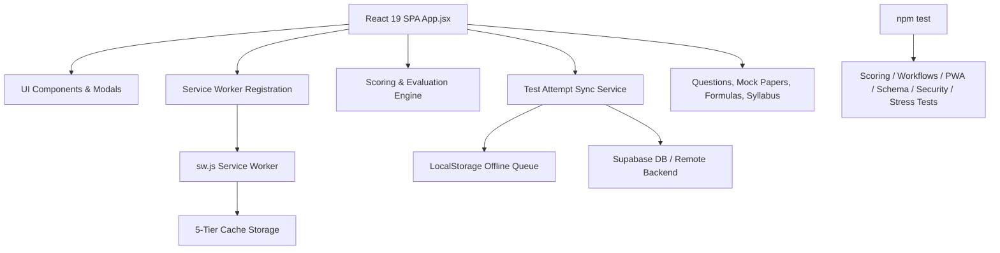

# GATE AG Prep Web Portal — Compact Project Reference & Master Context

> **Purpose**: This file serves as the consolidated single source of truth summarizing all prior discussions, architectural decisions, feature implementations, data schemas, scoring algorithms, PWA offline mechanisms, sync services, and automated test suites for the GATE AG Prep Web Portal. 
> Keep this document updated when adding major features to ensure maximum token efficiency and zero context loss in future sessions.

---

## 1. Project Overview & Tech Stack

- **Project Name**: GATE AG Prep Web Portal
- **Target Domain**: GATE Agricultural Engineering (AG) Competitive Exam Preparation
- **Architecture**: Client-side SPA (Single Page Application) with Offline-First PWA capabilities & Supabase Backend Sync.
- **Frontend Stack**: React 19, Vite 6, Tailwind CSS (v3.4), Lucide React (icons), KaTeX (LaTeX math rendering), Canvas Confetti.
- **Backend & Storage**: Supabase JS Client v2 (Auth, Test Attempts, Leaderboards), LocalStorage & IndexedDB (Offline Storage).
- **Test Infrastructure**: Native Node.js Test Runner (`node --test tests/**/*.test.js`), `node:assert/strict`. Single command `npm test` runs **359 tests across 76 suites (100% passing, exit code 0)**.

---

## 2. Core Architecture & Subsystems

### A. Progressive Web App (PWA) & Offline Engine
- **Manifest**: `public/manifest.webmanifest` & `public/manifest.json` (Standalone display mode, theme `#0f172a`, background `#020617`, standard 192/512/maskable/SVG/Apple icons).
- **Service Worker (`public/sw.js`)**: 
  - Versioned caches: `STATIC_CACHE`, `RUNTIME_CACHE`, `IMAGES_CACHE`, `CONCEPTS_CACHE`, `CDN_CACHE`.
  - Precaches core app shell (`/`, `/index.html`, `/manifest.webmanifest`, icons).
  - Intercepts fetch events; falls back to cached `index.html` for offline navigation.
- **SW Client Registration (`src/serviceWorkerRegistration.js`)**: Registers SW on window load, manages online/offline state listeners.

### B. Offline Resilience & Sync Subsystem (`src/services/testAttemptService.js`)
- **Idempotent Attempt Tracking**: Every test attempt receives a unique `client_attempt_id` (UUID v4).
- **Offline Queue**: When offline or unauthenticated, test attempts are queued in `localStorage` with `_syncedToBackend: false`.
- **Automatic Re-sync**: Listens to `online` and `app-online` window events. Synchronizes pending attempts to Supabase table `test_attempts` idempotently without duplicates.
- **Data Merging**: Merges local and remote test history by student identifier (email or admission number) sorted chronologically.

### C. Question Datasets & Syllabus Taxonomy
- **Practice Dataset (`src/data/questions.json`)**: 260+ curated practice questions across 5 GATE AG sections.
- **Mock Papers Dataset (`src/data/mock_papers.json`)**: 20 official PYQ mock papers (1,421 questions covering GATE AG exams from 2007 to 2026).
- **Formula Sheet (`src/data/formulas.js`)**: 57 verified LaTeX formulas mapped across 8 official syllabus categories.
- **Syllabus (`src/data/syllabus.js` & `src/utils/syllabusTaxonomy.js`)**: 83 subtopics mapped to 5 primary sections:
  1. Engineering Mathematics
  2. Farm Machinery & Power
  3. Soil & Water Conservation Engineering
  4. Agricultural Process Engineering
  5. General Aptitude

---

## 3. Key Feature Workflows & Business Logic

### A. Practice Mode (`src/components/PracticeMode.jsx`)
- **Cascading Filters**: Section $\rightarrow$ Topic $\rightarrow$ Subtopic.
- **Secondary Filters**: Question Type (MCQ, MSQ, NAT), Marks (1 or 2), Status (Bookmarked, Unattempted, Correct, Incorrect).
- **Section Normalization**: Normalizes varied section naming strings into 5 canonical titles.

### B. CBT Mock Test Engine (`src/components/MockTestMode.jsx`)
- **Timer Math**: 180-minute countdown with automatic submission upon expiration.
- **Per-Question Timer**: Active countdown/countup timer per question tracking cumulative seconds spent (`questionTimes`). Restores time when revisiting questions.
- **Question Palette (5 States)**:
  1. `NOT_VISITED` (Gray)
  2. `NOT_ANSWERED` (Red)
  3. `ANSWERED` (Green)
  4. `MARKED` (Purple)
  5. `ANSWERED_MARKED` (Purple with green dot)

### C. Test Result & Performance Diagnostics (`src/components/TestResultModal.jsx`)
- **Pacing & Speed Metrics**: Evaluates question pacing relative to GATE benchmarks (`getQuestionPacing`: Rapid Fire `<60s`, Optimal `60-150s`, High Investment `>150s`, Rush Trap `≤45s wrong`, Sinkhole `>180s wrong`, Clean Skip `0s`).
- **Performance Breakdown Matrix**: Interactive toggle between Detailed Review Cards and Tabular Breakdown Matrix.
- **Scorecard PDF Export**: Printable scorecard including question-by-question time spent, marks awarded, and pacing evaluation.

### C. Scoring & Evaluation Rules (`tests/scoring.test.js`)
- **MCQ (Multiple Choice Questions)**:
  - 1-Mark MCQ: Correct = $+1.00$, Incorrect = $-\frac{1}{3} \approx -0.33$, Unattempted = $0.00$.
  - 2-Mark MCQ: Correct = $+2.00$, Incorrect = $-\frac{2}{3} \approx -0.67$, Unattempted = $0.00$.
- **MSQ (Multiple Select Questions)**:
  - Exact set match required (order-independent, whitespace/comma/semicolon tolerant).
  - Partial matches or extra wrong options = $0.00$ marks.
  - Negative deductions = Strictly $0.00$ (No negative marking).
- **NAT (Numerical Answer Type)**:
  - Exact scalar value OR scalar tolerance ($\pm 0.05$) OR range interval ($[\text{min}, \text{max}]$ inclusive).
  - Invalid inputs ($\text{NaN}$, non-numeric text) = $0.00$ marks.
  - Negative deductions = Strictly $0.00$ (No negative marking).
- **AIR Percentile & Tier Mapping**:
  - $\ge 60$ marks $\rightarrow$ Top 10 AIR Tier
  - $45 - 59.99$ marks $\rightarrow$ Top 50 AIR Tier
  - $35 - 44.99$ marks $\rightarrow$ Top 200 AIR Tier
  - $25 - 34.99$ marks $\rightarrow$ Qualifying Cutoff Tier
  - $< 25$ marks $\rightarrow$ Needs Revision Tier

---

## 4. Automated Test Suite & Coverage Map

Running `npm test` executes `node --test tests/**/*.test.js`:

| Test File | Test Count | Key Areas Covered |
|-----------|-----------:|-------------------|
| `tests/scoring.test.js` | 31 | MCQ (+1/+2, -1/3, -2/3), MSQ (exact match, order, partial=0), NAT (tolerance $\pm 0.05$, range), AIR tiers |
| `tests/workflows.test.js` | 18 | Practice mode filters, CBT palette state transitions, 180m timer math, Formula sheet search |
| `tests/pwa.test.js` | 16 | Manifest schema, SW 5-tier caching, offline navigation fallback, SW registration lifecycle |
| `tests/dataset.test.js` | 12 | Practice dataset, 20 mock papers integrity, formula LaTeX syntax & brace balance, syllabus taxonomy |
| `tests/stress.test.js` | 45 | Float precision epsilon ($0.1 + 0.2$), MSQ string normalizations, negative marking toggle, 0/0 accuracy division |
| `tests/sync.test.js` | 18 | UUID generation, offline queueing in localStorage, idempotent re-sync, attempt deduplication |
| `tests/security.test.js` | 24 | Input sanitization, profanity filtering, auth state validation |
| `tests/question_timer_performance.test.js` | 14 | Question pacing benchmarks, timer accumulation, attempt breakdown & metrics |
| `tests/theme_engine.test.js` | 4 | Streamlined 2-theme invariant, CSS class validation, typography contrast |
| *Other Suites (`adversarial`, `schema`, `auth`, `concepts`, `custom_mocks`, `feedback`, `forensic`, `xp`)* | 177 | Full end-to-end subsystem validation |
| **TOTAL** | **359 Tests** | **100% Pass (0 Fail, 0 Skip, Exit Code 0)** |

---

## 5. Token Savings & Execution Directives for AI Agents

When working on this codebase in future sessions, follow these directives:

1. **Do Not Re-analyze Existing Files**: Consult this `PROJECT_CONTEXT.md` for architecture details, state constants, and scoring rules before spending context/tokens inspecting unchanged data/components.
2. **Always Run Verification**: Execute `npm test` after any change to confirm no regressions.
3. **Preserve Offline-First Contract**: Any new feature or service must degrade gracefully to `localStorage` / offline mode if network or remote backend is unreachable.
4. **Maintain State Constants**: Use exact strings `NOT_VISITED`, `NOT_ANSWERED`, `ANSWERED`, `MARKED`, `ANSWERED_MARKED` for CBT question palette state machine.
5. **Keep LaTeX Valid**: Ensure all formula strings render cleanly with KaTeX and have balanced brackets.
6. **Dual-Theme Fidelity**: Adhere to the streamlined 2-theme architecture (`dark` & `light`) and ensure all UI elements provide high contrast in Light Mode.

---
*Last Consolidated & Verified: 2026-09-05 (359 / 359 Tests Passing across 76 Suites)*
