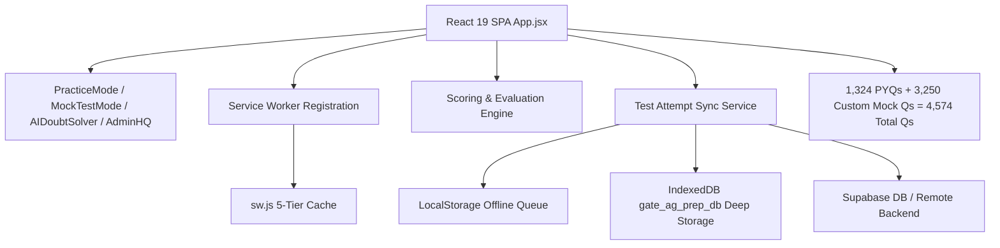

# GATE AG Prep Web Portal — Master Project Context & Knowledge Base

> **Single Source of Truth**: This document consolidates all architecture, schemas, scoring rules, offline sync engine, security posture, UI invariants, and testing specifications. Consult this file first to avoid redundant codebase exploration and minimize token consumption during `/boost` and agent sessions.

---

## 1. System Architecture & Tech Stack

- **Application**: Offline-First Single Page Application (SPA) & Progressive Web App (PWA).
- **Core Stack**: React 19, Vite 6, Tailwind CSS (v3.4), Lucide React, KaTeX (LaTeX math rendering), Canvas Confetti.
- **Backend & Storage**: Supabase JS Client v2 (Auth, Test Attempts, Solvers Leaderboard), LocalStorage & IndexedDB (Offline cache & sync queue).
- **Test Infrastructure**: Native Node.js Test Runner (`node --test tests/**/*.test.js`), `node:assert/strict`.
- **Verification Commands**:
  - `npm test`: **668 tests across 119 suites (100% passing, 0 failures, exit code 0)** in ~1.2s.
  - `npm run build`: Clean production bundle compiled into `dist/` in ~2.1s.

---

## 2. Core Subsystems & Interface Contracts

### A. PWA & 5-Tier Cache Architecture (`public/sw.js`, `src/serviceWorkerRegistration.js`)
- **Manifest**: `public/manifest.webmanifest` & `public/manifest.json` (Standalone display mode, theme `#0f172a`, background `#020617`, icons 192/512/maskable/SVG/Apple).
- **5 Caching Tiers**:
  1. `STATIC_CACHE`: Precaches shell (`/`, `/index.html`, `/manifest.webmanifest`, icons).
  2. `RUNTIME_CACHE`: Bundled JS/CSS modules under `/assets/`.
  3. `IMAGES_CACHE`: Question images and diagrams (`/question_images/`, `/docx_images/`).
  4. `CONCEPTS_CACHE`: Static concept notes and syllabi.
  5. `CDN_CACHE`: External font/style fallbacks.
- **Offline Navigation Fallback**: Intercepts `request.mode === 'navigate'` and returns cached `index.html`.

### B. Offline Resilience & Sync Subsystem (`src/services/testAttemptService.js`)
- **UUID Generation**: Every attempt gets a client-generated UUID v4 (`client_attempt_id`).
- **Deep Storage & Offline Queueing**: Complete attempts with full `question_responses` (selected answers, marks, timing) are saved to IndexedDB (`gate_ag_prep_db`) and queued in `localStorage` with `_syncedToBackend: false`.
- **Automatic Re-sync**: Listens to `online` and `app-online` window events; pushes pending attempts to Supabase table `test_attempts` idempotently without duplicates.
- **Guest-to-User Claiming**: Guest mock attempts stored prior to login are claimed via `associateGuestAttemptsWithStudent()`.
- **History Merging**: Merges local and remote attempts by student identifier (email or admission roll number) sorted chronologically.

### C. CBT Mock Test Engine & Palette States (`src/components/MockTestMode.jsx`)
- **Question Palette (5 Invariant States)**:
  1. `NOT_VISITED` (Gray)
  2. `NOT_ANSWERED` (Red)
  3. `ANSWERED` (Green)
  4. `MARKED` (Purple)
  5. `ANSWERED_MARKED` (Purple with green indicator)
- **Wall-Clock Timers & Crash Recovery**: 180-minute countdown based on target wall-clock timestamp (`targetEndTimeRef`) with `visibilitychange` resync and auto-submit; active state saved to `gate_ag_active_cbt_session` with throttled disk writes (on user actions and 10s intervals).
- **TCS iON Keypad**: Floating on-screen numeric keypad for NAT inputs (`0-9`, `.`, `-`, `Backspace`, `Clear`).
- **Pacing Metrics (`getQuestionPacing`)**: Rapid Fire (<60s), Optimal (60–150s), High Investment (>150s), Rush Trap (≤45s wrong), Sinkhole (>180s wrong), Clean Skip (0s).

### D. Scoring & Evaluation Engine (`tests/scoring.test.js`, `src/utils/scoring.js`)
- **MCQ**:
  - 1-Mark: Correct = $+1.00$, Incorrect = $-\frac{1}{3} \approx -0.33$, Unattempted = $0.00$.
  - 2-Mark: Correct = $+2.00$, Incorrect = $-\frac{2}{3} \approx -0.67$, Unattempted = $0.00$.
  - Bi-directional letter-key and option-text defensive fallback.
- **MSQ**: Exact set match required (order-independent, delimiter/whitespace tolerant, supports contiguous tokens like `"AC"`). Partial credit = $0.00$. Negative marking = $0.00$.
- **NAT**: Scalar tolerance ($\pm 0.05$, IEEE-754 epsilon tolerant) OR range interval ($[\text{min}, \text{max}]$ inclusive, e.g. `"1.90 to 2.10"` or hyphen ranges). Negative marking = $0.00$. Non-numeric = $0.00$.
- **AIR Percentile Tiers**:
  - $\ge 60$ marks $\rightarrow$ Top 10 AIR Tier
  - $45 - 59.99$ marks $\rightarrow$ Top 50 AIR Tier
  - $35 - 44.99$ marks $\rightarrow$ Top 200 AIR Tier
  - $25 - 34.99$ marks $\rightarrow$ Qualifying Cutoff Tier
  - $< 25$ marks $\rightarrow$ Needs Revision Tier

### E. Security, Roles & Moderation (`src/utils/security.js`, `tests/security.test.js`)
- **Admin Auth**: Compares admin passcodes against SHA-256 digests (never plaintext strings).
- **Roles & Permissions**: `student`, `solver` (can verify solutions), `faculty_mentor`, `admin`.
- **Content Moderation**: Automated profanity filter, timeout mutes, ban lists, and moderation audit log.
- **Question Issue Reporting**: Two-tier persistence (localStorage + `question_reports` table) with Admin triage workflow.
- **Visitor Mode**: Guest access with auth-gate interceptors on persistence actions.

### F. Theme Engine & Contrast Invariants (`src/components/ThemeToggle.jsx`)
- **Strict 2-Theme System**: Exactly `light` (Light Mode, default) and `dark` (Dark Theme).
- **Dual-Theme Contrast Rules**:
  - Never use hardcoded dark containers (`bg-slate-900`) or white text (`text-white`) without responsive light mode counterparts (`bg-white dark:bg-slate-900`, `text-slate-900 dark:text-white`).
  - Inputs & search bars: `bg-slate-50 dark:bg-slate-950/80`, `text-slate-900 dark:text-white`.
  - Subtitles & rule text: `text-slate-600 dark:text-slate-400`.

---

## 3. Dataset Inventory & Taxonomy

| Dataset | Location | Count / Scope | Details |
|---|---|---|---|
| **Practice Pool** | `src/data/questions.json` | 1,324 questions | Strictly official PYQs (2007–2026) with explanatory solutions, MCQ/MSQ/NAT |
| **Official Mock Papers** | `src/data/mock_papers.json` | 20 official papers | Full papers 2007 through 2026 (1,324 total questions, 180 min, 100 marks) |
| **Custom Mock Papers** | `src/data/custom_mock_2027_XX.json` | 50 mock papers | 50 full-length mocks (3,250 questions, 65 Qs / 100 M each, 100% Hard Multi-Chain) |
| **Formulas** | `src/data/formulas.js` | 57 formulas in 8 categories | Validated LaTeX strings, balanced braces, categories: EM, FMP, FP, SWCE, IDE, APE, DFE, GA |
| **Syllabus** | `src/data/syllabus.js` | 8 sections, 83 subtopics | Granular breakdown with official weightage mappings |

---

## 4. Test Suite Coverage Summary (561 Tests across 93 Suites)

Run via `npm test` (`node --test tests/**/*.test.js`):
- `scoring.test.js` (31 tests): MCQ/MSQ/NAT evaluation, penalties, score rounding, AIR tiers.
- `custom_mocks.test.js` (150 tests): Validates all 50 custom mocks (schema, 65 Qs, 100 Marks, 10 GA / 55 Tech, MCQ keys format).
- `cbtStatePersistence.test.js` (4 tests): CBT state recovery, active timer adjustment, keypad input.
- `gateCompliance.test.js` (4 tests): GATE exam compliance, mark distribution, negative marking.
- `mistakeVaultIsolation.test.js` (5 tests): Multi-user mistake vault isolation and repeat error counters.
- `workflows.test.js` (18 tests): Practice filters, CBT palette transitions, timer math, formula search.
- `pwa.test.js` (16 tests): Manifest, SW 5-tier caching, offline navigation fallback, SW registration.
- `dataset.test.js` & `schema.test.js` (31 tests): 1,324 questions schema, 20 official papers, taxonomy parity.
- `stress.test.js` (45 tests): Floating-point epsilon ($0.1 + 0.2$), delimiter normalizations, 0/0 accuracy safety.
- `sync.test.js` (18 tests): UUID generation, offline queue, idempotent re-sync, deduplication.
- `historyPersistence.test.js` (4 tests): Guest attempt claiming, IndexedDB & LocalStorage merged retrieval.
- `security.test.js` & `profanityFilter.test.js` (24+ tests): SHA-256 passcodes, XSS sanitization.
- `theme_engine.test.js` (4 tests): 2-theme invariant, typography contrast.
- `user_roles_moderation.test.js` (8 tests): Roles, permissions, mutes, bans, audit log.
- `visitor_mode.test.js` (3 tests): Guest flags, visitor permissions, auth gate.
- `question_timer_performance.test.js` (14 tests): Pacing benchmarks, cumulative tracking.
- *Additional Suites* (185+ tests): Calculator, CBT skins, command palette, concepts, PDF generator, radar diagnostics, feedback, forensics, AI doubt solver, question reports, dataset quality, notifications, roll number parser, XP sync.

---

## 5. Agent Directives for Maximum Token Efficiency

1. **Rely on this Context**: Do not crawl or re-analyze raw data files (`questions.json`, `mock_papers.json`) or unchanged components unless modifying them directly.
2. **Execute Verification**: Always run `npm test` after code changes; ensure 561/561 tests pass.
3. **Preserve Contracts**:
   - Palette state constants: `NOT_VISITED`, `NOT_ANSWERED`, `ANSWERED`, `MARKED`, `ANSWERED_MARKED`.
   - Maintain 100% offline functionality with graceful `localStorage` and `IndexedDB` fallback.
   - Maintain dual-theme contrast (`dark` and `light` only).
